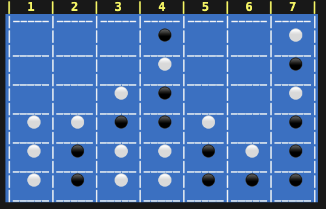

# Connect Four



## Introduction

Connect Four is a classic two-player game where players take turns dropping colored discs into a vertical grid. The objective is to be the first to form a horizontal, vertical, or diagonal line of four of one's own discs. This project implements the game in Ruby, focusing on Test-Driven Development (TDD) principles.

## Features

- **Two-Player Mode:** Players can compete against each other.
- **Win Condition:** The game checks for a win condition after each turn.
- **Draw Condition:** The game will recognize if all spaces are filled without a winner.
- **Colorful Output:** Unicode symbols enhance the visual representation of game pieces.

## Getting Started

### Prerequisites

- Ruby
- Bundler

### Installation

1. Clone the repository:

   ```bash
   git clone https://github.com/PivtoranisV/connect-four.git
   ```

2. Navigate to the project directory:

   ```bash
   cd connect-four
   ```

3. Install the required gems:

   ```bash
   bundle install
   ```

## How to Play

1. Run the game:

```bash
  bundle exec ruby main.rb
```

1. Follow the prompts to enter player names and select pieces.
1. Players take turns choosing a column to drop their piece.
1. The first player to connect four pieces wins the game!

## Test-Driven Development Approach

This project follows a TDD approach, where tests are written before the implementation of each feature. The general workflow includes:

1. Write a failing test.
2. Implement the minimal code required to pass the test.
3. Refactor the code for improvement while ensuring all tests still pass.

This methodology helps ensure that the code remains clean and maintainable while continuously validating its functionality.
